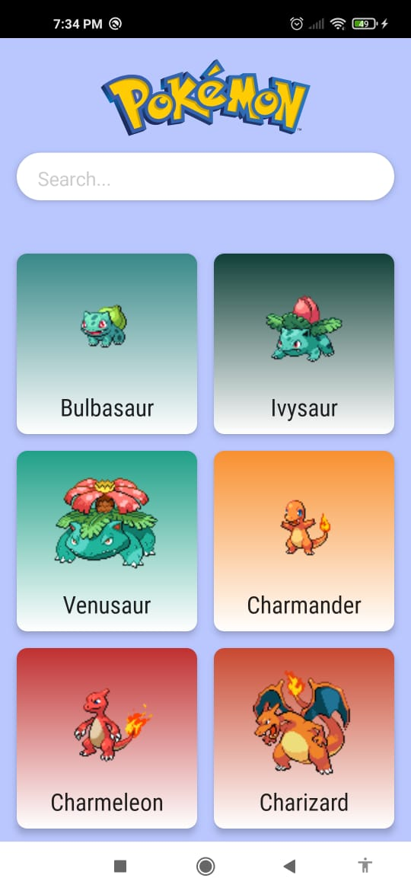
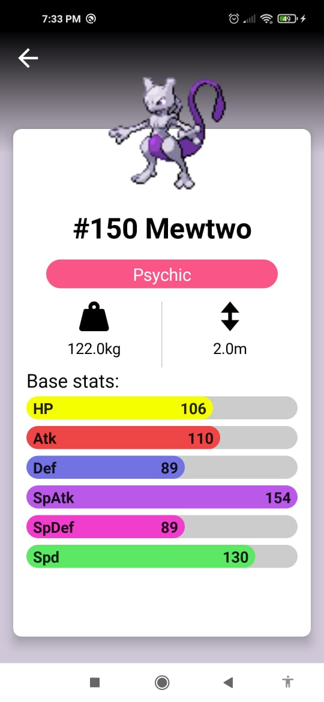
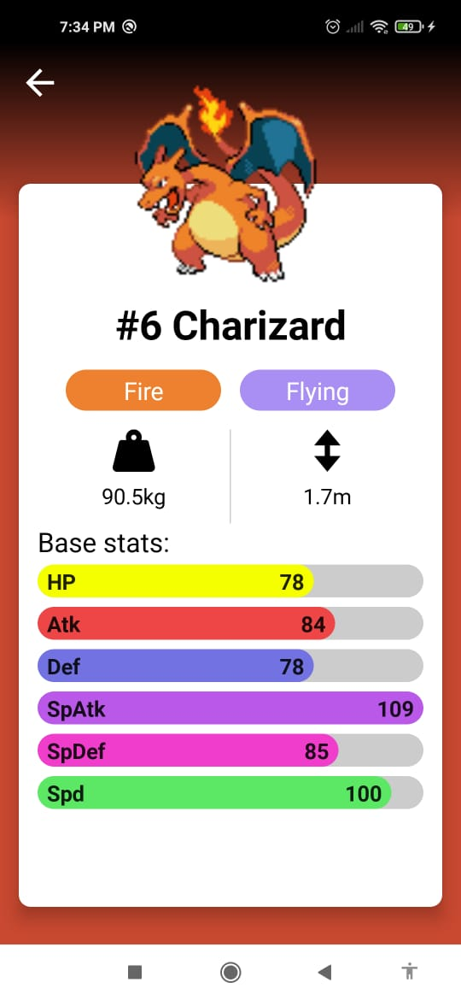

### Compose-Pokemon-Hilt-Dagger-MVVM-Retrofit-
Work with compose in order to understand it better and display an interesting app based on pokemon Api

### Libraries Used 

* Coil
* Dagger-Hilt
* Coroutines
* Timber
* Retrofit
* Pallet

  

